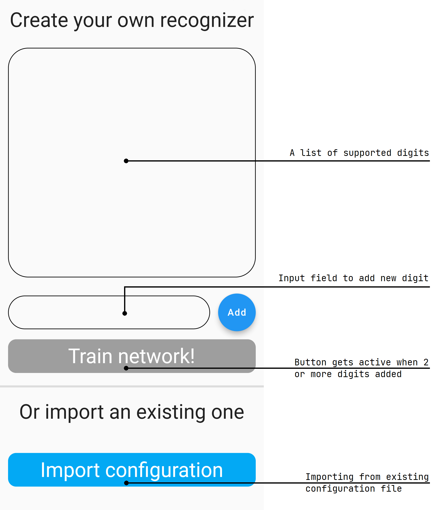
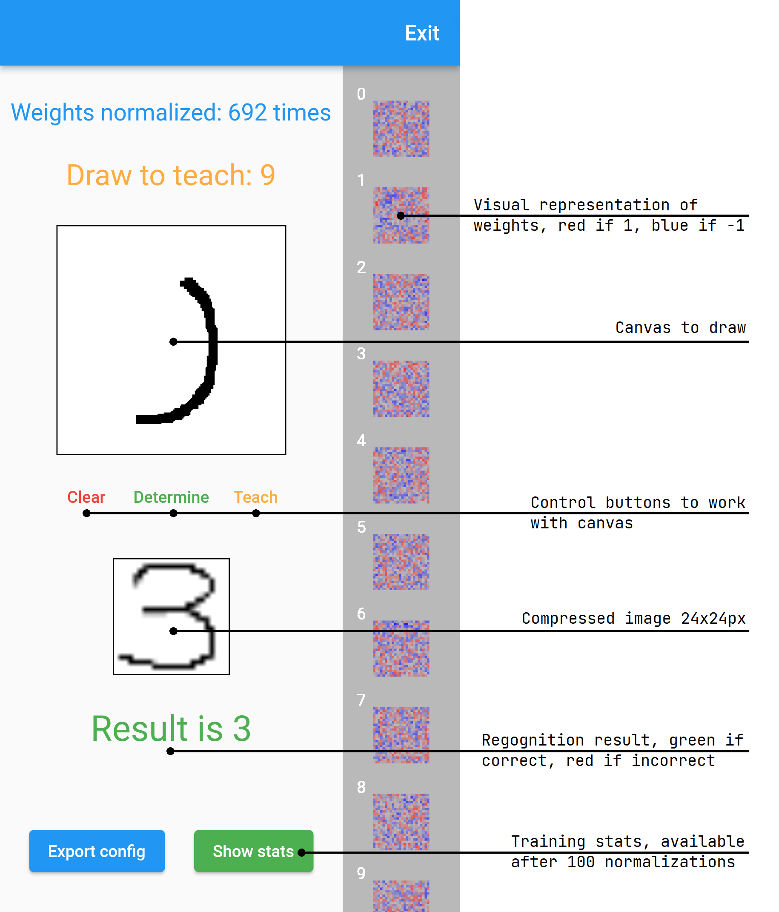
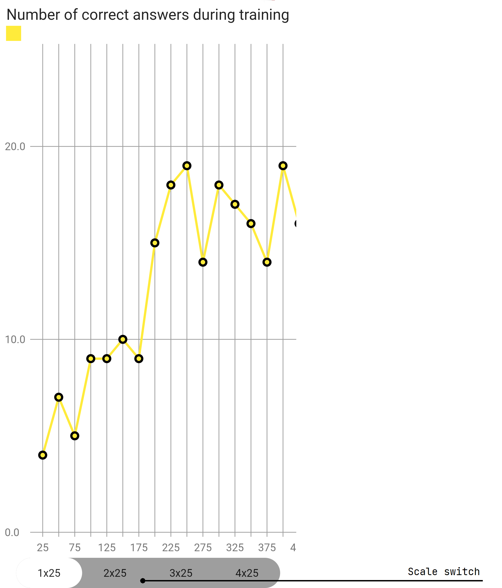
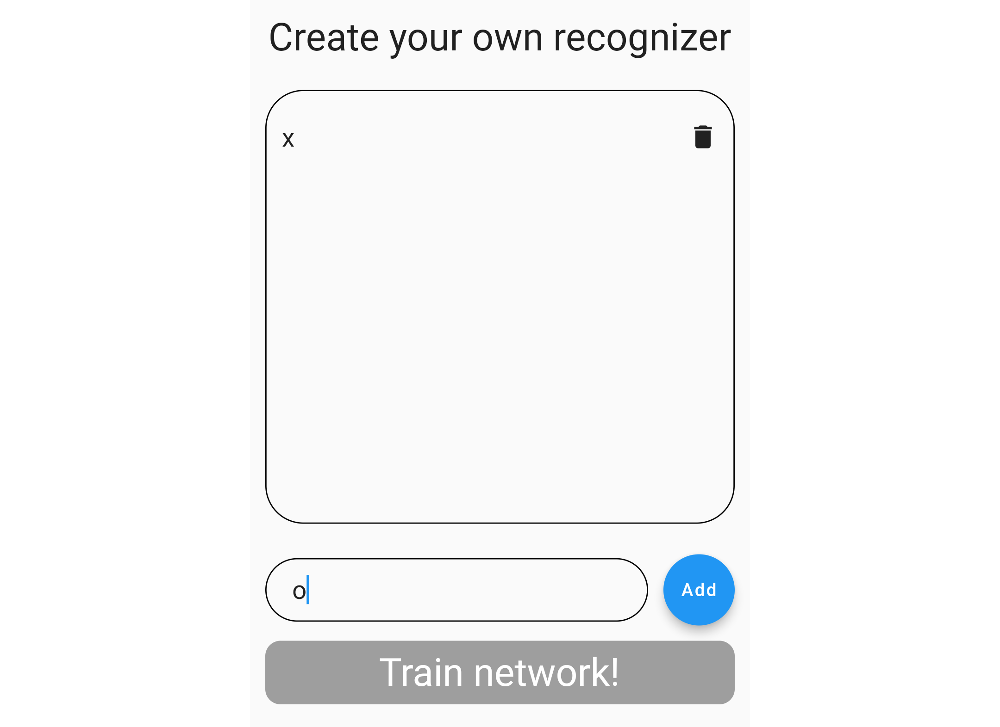
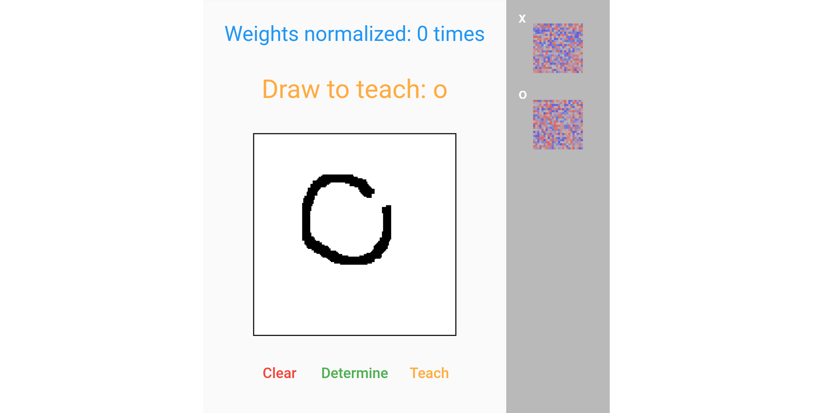
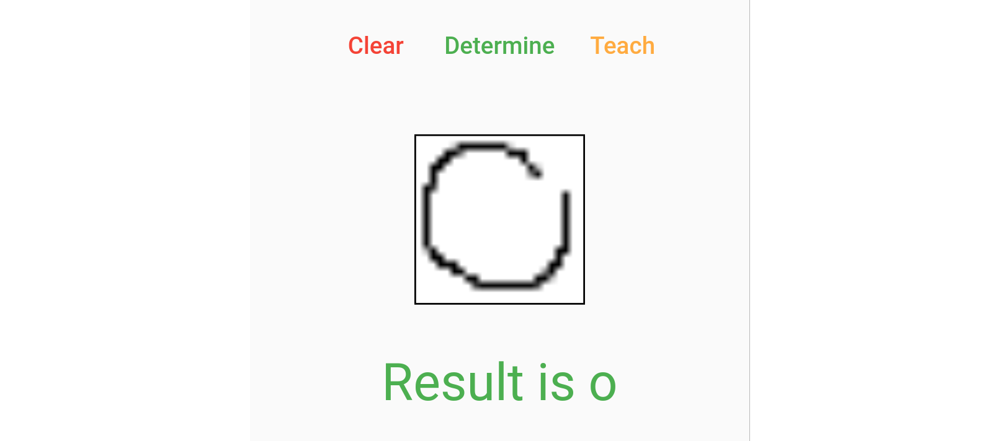

# Digit Recognition

Recognition is a mobile application that utilizes machine learning to recognize various characters. The application is designed more to demonstrate the capabilities of machine learning, and not for everyday use, but this does not make it less interesting, but rather the opposite.

## User interface

### Start screen:

### Home screen:

### Stats screen:

## Use-cases
### Train network from scratch:

1. Add 2+ digits (better if they look different, i and l probably won't work)
2. Press "Train network!"

3. Check "Draw to teach" sign
4. Draw suggested digit on canvas
5. Press "Teach"

### Determine digit:
1. Draw digit on canvas
2. Press "Determine"
3. Check result

